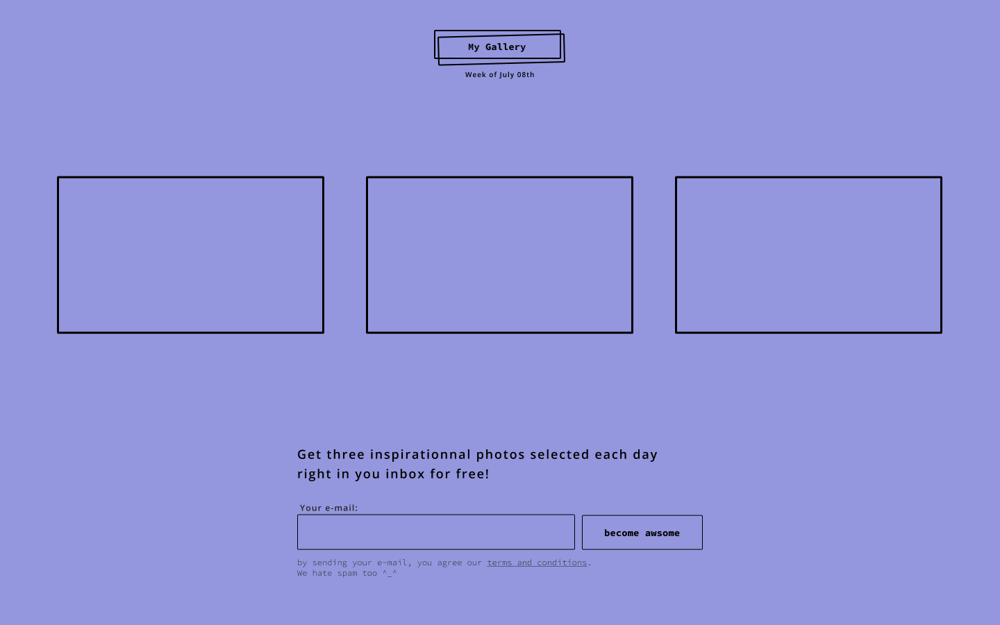

# My Gallery

*A project inspired by the [JavaScript for WordPress Workshop 2020](https://github.com/siriusnottin/jsforwp-conf-workshop-2020).*

## What is this

One week, three photos that summarize the latest news.

## What I used

I used my actual knowledge in development and that I acquired by the workshop on the first day with HTML, CSS (SASS) and JavaScript.

### The web design

I made the [interface with Figma](https://www.figma.com/file/E3dKgosEeflZCEPVOkWIbr9Y/jsforwp-conf-workshop-2020?node-id=1%3A2) and the animations was designed [using ProtoPie](https://share.protopie.io/aiVA4d3StFW).

## Roadmap

These are the modifications I want to apply to my project in the near future:

- Use of React
- Use of webpack and Yarn instead of gulp and npm
- Create a WordPress plugin
- Instead of using fake pictures, use an [real API](https://api.ap.org/media/v/docs/api/) to automatically grab actual pictures.
- Build the newsletter for real
- Optimize the code
- Better code organization
- Any suggestions?

## Contribute

You can share me your thoughts about this project by opening an issue! 🚀
I would love to exchange about this! Without your comments, I could'nt be a better passionate coder 💪

### **Dependencies**

***Note:** if you've previously installed Gulp globally, run `npm rm --global gulp` to remove it. [Details here.](https://medium.com/gulpjs/gulp-sips-command-line-interface-e53411d4467)*

Make sure these are installed first.

- [Node.js](http://nodejs.org/)
- [Gulp Command Line Utility](http://gulpjs.com/) `npm install --global gulp-cli`

### Quick Start

From the docs of [Gulp Boilerplate](https://github.com/cferdinandi/gulp-boilerplate):

1. In bash/terminal/command line, `cd` into your project directory.
2. Run `npm install` to install required files and dependencies.
3. When it's done installing, run one of the task runners to get going:
    - `gulp` manually compiles files.
    - `gulp watch` automatically compiles files and applies changes using [BrowserSync](https://browsersync.io/) when you make changes to your source files.

**Try it out.** After installing, run `gulp` to compile some test files into the `dist` directory. Or, run `gulp watch` and make some changes to see them recompile automatically.

## Credits

I also used [Gulp Boilerplate](https://github.com/cferdinandi/gulp-boilerplate) and [Simple Typography](https://github.com/AdamMarsden/simple-typography), they helped me to not reinvent the wheel, and save some time.

## License

Copyright of [Sirius Nottin](https://nottin.me/) and contributors.

Licensed under the MIT license.
